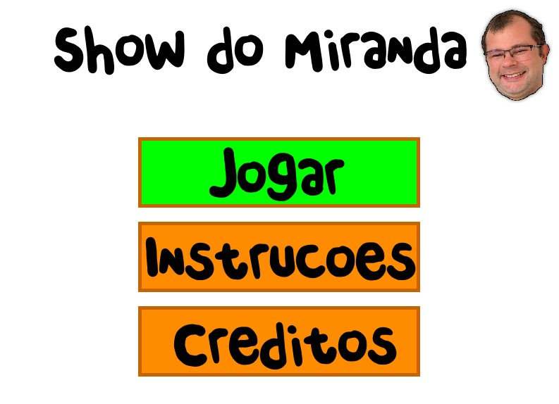
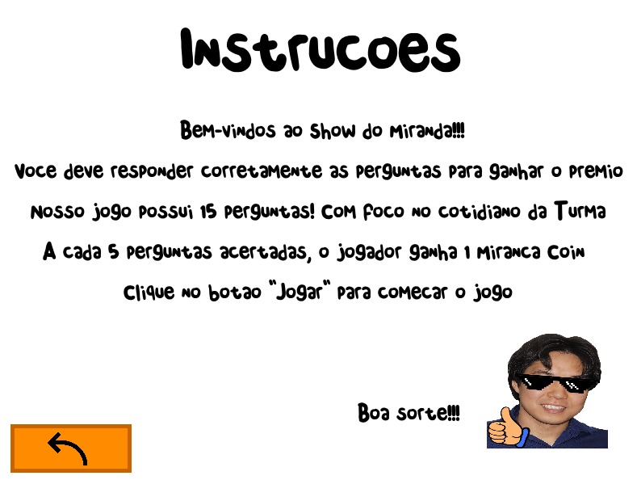

# [Show do Miranda]

Descrição do jogo
Jogo estilo Gênio quiz de André Birnfeld, adaptado para temas do cotidiano de alguém que cursa ciência da computação no insper em 2023!

Como jogar
Para jogar, é necessário ter o Python 3 instalado na máquina.
Após instalar a biblioteca pygame,o jogo será aberto em uma janela de terminal e pode ser jogado com as seguintes teclas:

Movimento: clique orientado pelo cursor do mous

Imagens do jogo:

Fontes e imagens utilizadas:

[Fotos Professores](https://www.insper.edu.br/graduacao/ciencia-da-computacao/)
[PNG Seta](https://www.flaticon.com/br/icone-gratis/seta-esquerda_7772089?term=seta&page=4&position=89&origin=tag&related_id=7772089)
[Fonte Quiz](https://www.dafont.com/chendolle.font)
[PNG oculos](https://pt.pngtree.com/freepng/pixel-8-bit-black-glasses_7903017.html)
[PNG joia](https://imagenspng.com/download/emoji-joinha-png-imagem-com-fundo-removido-transparente-gratis-para-baixar/)

